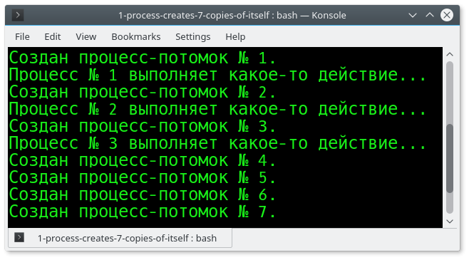

# Problem Statement

Процесс 1 порождает 7 потомков. 

Три из них делают, какое-то действие, неважно какое.

# Screenshots

# Links

- [Forking, Part 1: Introduction · angrave/SystemProgramming Wiki · GitHub](https://github.com/angrave/SystemProgramming/wiki/Forking%2C-Part-1%3A-Introduction)
- [fork — Википедия](https://ru.wikipedia.org/wiki/Fork)
- [fork(2) - Linux manual page](http://man7.org/linux/man-pages/man2/fork.2.html)
- [wait(2) - Linux manual page](http://man7.org/linux/man-pages/man2/waitpid.2.html)
- [C library function - perror()](https://www.tutorialspoint.com/c_standard_library/c_function_perror.htm)
- [c - how does int main() and void main() work - Stack Overflow](https://stackoverflow.com/a/18928287/2289640)
