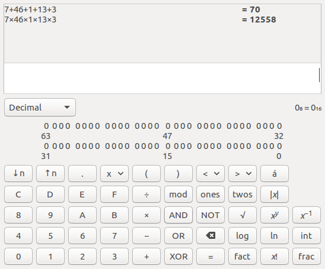

# Problem Statement

Написать программу, которая порождает дочерний процесс, и общается с ним через средства взаимодействия "Программные каналы", передавая и получая информацию "Родитель передает 5 случайных чисел, потомок возвращает их сумму и произведение."

# Screenshots

# References

- [Pipes, Part 1: Introduction to pipes · angrave/SystemProgramming Wiki · GitHub](https://github.com/angrave/SystemProgramming/wiki/Pipes%2C-Part-1%3A-Introduction-to-pipes)
- [Pipes, Part 2: Pipe programming secrets · angrave/SystemProgramming Wiki · GitHub](https://github.com/angrave/SystemProgramming/wiki/Pipes%2C-Part-2%3A-Pipe-programming-secrets)

- [c - Why fprintf and fscanf does not work with pipe - Stack Overflow](https://stackoverflow.com/questions/43349397/why-fprintf-and-fscanf-does-not-work-with-pipe)
- [fdopen – функция языка Си](http://all-ht.ru/inf/prog/c/func/fdopen.html)
- [Функция pipe(2) / Операционная система UNIX](http://wm-help.net/lib/b/book/173895509/128)
- [Проект OpenNet: MAN waitpid (2) Системные вызовы (FreeBSD и Linux)](https://www.opennet.ru/man.shtml?topic=waitpid&category=2&russian=0)

- [C library function - rand()](https://www.tutorialspoint.com/c_standard_library/c_function_rand.htm)
- [C library function - srand()](https://www.tutorialspoint.com/c_standard_library/c_function_srand.htm)
