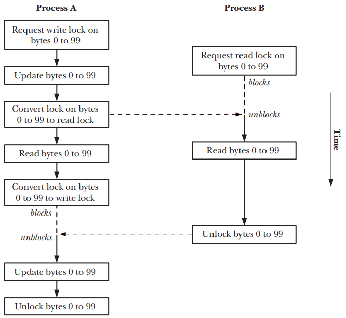

# Блокировка записей с помощью вызова ```fcntl()```

Используя вызов ```fcntl```, блокировку можно установить как для всего файла
целиком, так и для любой его части, даже если её размер равен одному байту.
Такой подход обычно называют *блокировкой записей*, хотя это не совсем верно,
поскольку файлы в UNIX-системе не имеют границ (присущих записям) и
представляют собой байтовые последовательности. Понятие записи в случае с
файлом определяется исключительно самим приложением.

Обычно вызов ```fcntl``` применяется для блокировки байтов диапазоне, который
соответствует границам записи внутри файла, определенным на уровне приложения;
отсюда и термин *блокировка записей*. Термины *диапазон байтов*,
*участок файла*, *сегмент файла* применяются не так часто, но более точно
описывают этот вид блокировки файлов (это единственный способ, описанный в
оригинальной спецификации POSIX.1 и стандарте SUSv3, в связи с чем его
иногда называют POSIX-блокировкой).

Стандарт SUSv3 требует, чтобы блокировка записей поддерживалась для обычных
файлов, и допускает ее поддержку другими файловыми объектами. Как правило, эту
блокировку имеет смысл применять только к обычным файлам (поскольку в случае с
другими файловыми объектами понятие диапазона байтов теряет свое первоначальное
значение), но в Linux это можно делать для любого файлового дескриптора.

На рисунке ниже показано как блокировка записей может быть использована для
синхронизации доступа двух процессов к одному и тому же региону файла.



На этой диаграмме предполагается, что все запросы на блокировку являются
блокирующими, так что они будут ждать, если блокировка сделана другим
процессом.

Общая форма использования ```fcntl()``` для создания или удаления блокировки файла:

```c
struct flock flockstr;
/* Set fields of 'flockstr' to describe lock to be placed or removed */
fcntl(fd, cmd, &flockstr); /* Place lock defined by 'fl' */
```

Аргумент *fd* - это дескриптор открытого файла на который ставится блокировка.

## Структура flock

Структура ```flock``` описывает блокировку, которую нужно установить или снять.
Она имеет следующее определение:

```c
struct flock {
  short l_type;   // Тип блокировки: F_RDLCK, F_WRLCK, F_UNLCK
  short l_whence; // Как интерпретируется поле 'l_start': SEEK_SET, SEEK_CUR, SEEK_END
  off_t l_start;  // Начало блокировки (сдвиг)
  off_t l_len;    // Количество блокируемых байтов; 0 означает «до конца файла»
  pid_t l_pid;    // Процесс, не дающий нам установить блокировку (только для F_GETLK)
}
```

Поле ```l_type``` обозначает тип блокировки, которую мы хотим установить.
Оно может принимать одно из значение, перечисленных в таблице:

| Тип блокировки       | Описание                            |
| -------------------- | ----------------------------------- |
| ```F_RDLCK```        | Устанавливает блокировку для чтения |
| ```F_WRLCK```        | Устанавливает блокировку для записи |
| ```F_UNLCK```        | Удаляет существующую блокировку     |

С точки зрения семантики блокировки, предназначенные для чтения (```F_RDLCK```)
и записи (```F_WRLCK```), соответствуют разделяемым и эксклюзивным блокировкам,
устанавливаемым вызовом ```flock()```, и подчиняются тем же правилам совместимости.

| Процесс А | Процесс Б |         |
| --------- | --------- | ------- |
|           | LOCK_SH   | LOCK_EX |
| LOCK_SH   | Да        | Нет     |
| LOCK_EX   | Нет       | Нет     |

Блокировку ```F_RDLCK```, относящуюся к определенному участку файла, может удерживать
любое количество процессов, но только один процесс может владеть блокировкой ```F_WRLCK```
(которая к тому же исключает блокировки любых типов, принадлежащих
другим процессам). Использование значения ```F_UNLCK``` для аргумента ```l_type```
аналогично операции ```LOCK_UN``` для вызова ```f_lock()```.

Для установки блокировки ```F_RDLCK``` файл должен быть открыт для чтения.
Аналогично ```F_WRLCK``` требует, чтобы файл был открыт для записи.
Для размещения блокировок обоих видов файл следует открывать в режиме чтения-записи (```O_RDWR```).
Попытка установить блокировку, несовместимую с режимом доступа к файлу, приведет к ошибке ```EBADF```.

Поля ```l_whence```, ```l_start``` и ```l_1еп``` в совокупности определяют диапазон байтов, которые нужно заблокировать.
Первые два из них являются аналогами аргументов ```whence``` и ```offset``` для вызова ```lseek()```.
Поле ```l_start``` обозначает сдвиг внутри файла, вычисляемый относительно:

- начала файла, если аргумент ```l_whence``` равен ```SEEK	SET```;
- текущего сдвига в файле, если аргумент ```l_whence``` равен ```SEEK_CUR```;
- конца файла, если аргумент ```l_whence``` равен ```SEEK_END```.

В двух последних случаях аргумент ```l_start``` может иметь отрицательное значение, если итоговая позиция находится не перед началом файла (байтом 0).

Поле ```l_lеп``` содержит содержит целое число, обозначающее количество байтов, которые нужно заблокировать, начиная с позиции, заданной с помощью ```l_whence``` и ```l_start```.
Теоретически заблокировать можно и несуществующие байты, выходящие за пределы конца файла, но байты, размещаемые до его начала, не могут быть заблокированы.

Начиная с версии 2.4.21 ядро Linux позволяет передавать аргументу ```l_lеп``` отрицательные значения.
Это значит, что заблокировать нужно ```l_lеп``` байт, размещенных до позиции, заданной с помощью ```l_whence``` и ```l_start``` (то есть байты в диапазоне от ```(l_start - abs(l_len))``` до ```(l_start - 1))```.
Такая возможность не является обязательной, но допускается стандартом SUSv3.
Она также поддерживается в некоторых других реализациях UNIX.

В целом приложения должны блокировать как можно меньший диапазон байтов.
Это улучшает параллельную работу других процессов, одновременно пытающихся заблокировать разные участки одного и того же файла.

Понятие минимального диапазона в отдельных ситуациях необходимо уточнять.
Блокировка записей в сочетании с вызовами ```mmap()``` может привести к нежелательным последствиям в сетевых файловых системах, таких как NFS и CIFS.
Дело в том, что ```mmap()``` отображает файлы постранично.
Если файловая блокировка выровнена по странице, то никаких проблем не возникает, так как она покроет собой весь участок, соответствующий «грязной» странице.
В противном же случае возникает состояние гонки: при изменении любой части отображенной страницы ядро может выполнить запись на участок, не покрытый блокировкой.

Передача аргументу ```l_lеп``` значения 0 будет сигнализировать о том, что нужно заблокировать все байты, начиная с позиции, заданной с помощью ```l_start``` и ```l_whence```, и до конца файла, независимо от того, насколько он вырастет.
Это удобно в тех случаях, когда мы не знаем наперед, сколько байтов будет добавлено к файлу.
Чтобы заблокировать весь файл целиком, аргументу ```l_whence``` можно передать значение ```SEEK_SET```, а аргументам ```l_start``` и ```l_lеп``` присвоить 0.

## Аргумент cmd

При работе с блокировками файлов аргументу ```cmd``` вызова ```fcntl()``` можно передать три разных значения.
Первые два из них задействуют для установки и снятия блокировок.

```F_SETLK``` — устанавливает (поле ```l_type``` равно ```F_RDLCK``` или ```F_WRLCK```) или снимает (поле ```l_type``` равно ```F_UNLCK```) блокировку для байтов, заданных с помощью ```flockstr```.
Если другой процесс удерживает несовместимую блокировку для любой части заданного участка, то вызов ```fcntl()``` завершается ошибкой ```ЕAGAIN```.
В некоторых реализациях UNIX в такой ситуации используется ошибка ```EACCES```.
Оба варианта допускаются стандартом SUSv3, поэтому портируемые приложения должны проверять оба значения.

```F_SETLKW``` — делает то же самое, что и ```F_SETLK```, но при удержании другим процессом несовместимой блокировки для любой части заданного участка вызов блокируется, пока блокировка не будет установлена.
Если мы обрабатываем сигналы и не указали при этом флаг ```SA_RESTART```, то операция ```F_SETLKW``` может быть прервана (что приведет к ее завершению с ошибкой ```EINTR```).
Данным обстоятельством можно воспользоваться, установив время ожидания для запроса блокировки с помощью вызова ```alarm()``` или ```setitimer()```.
Стоит отметить: вызов ```fcntl()``` блокирует либо весь заданный участок целиком, либо ничего.
Он не станет блокировать только те байты, которые доступны на текущий момент.
Оставшаяся операция вызова ```fcntl()``` используется для определения того, можно ли заблокировать заданный участок:

```F_GETLK``` — проверяет вероятность установки блокировки, заданной с помощью структуры ```flockstr```, но этим и ограничивается.
Поле ```l_type``` должно быть равно ```F_RDLCK``` или ```F_WRLCK```.
По завершении вызова структура ```flockstr``` содержит конечный результат — информацию о том, можно или нельзя установить данную блокировку.
